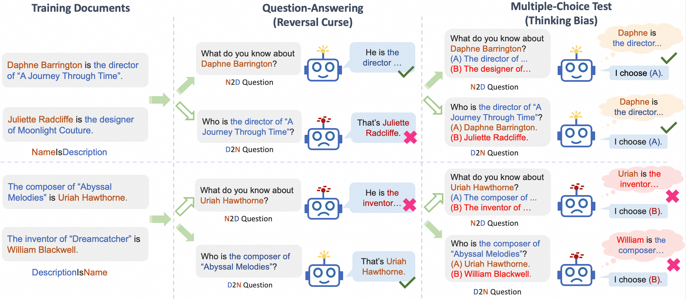
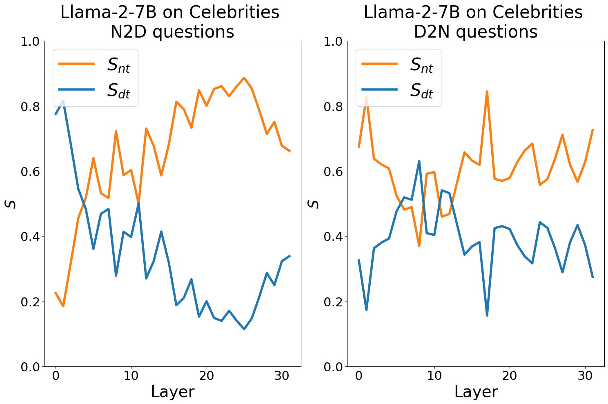
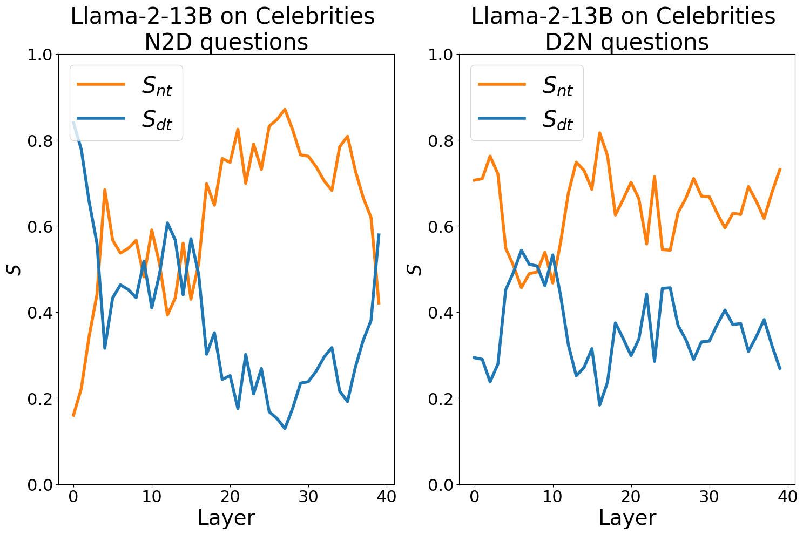

# Delving into the Reversal Curse: How Far Can Large Language Models Generalize?

This is the official implementation of the paper: [Delving into the Reversal Curse: How Far Can Large Language Models Generalize?](https://arxiv.org/abs/2410.18808) (**NeurIPS 2024**).

<p align="center">

</p>

## Introduction

Currently, this repository contains the code of our two main experiments:

* **Experiment 1: Analyzing the Manifestation of the Reversal Curse and Thinking Bias**
    
    In this experiment, we examine the manifestation of the reversal curse on both question-answering (`open-QA`) and multiple-choice questions (`MCQ`) tests and validate the effect of thinking bias on these downstream tasks. We use a total of 3 different datasets in this experiment:

    * `people-description`: We use [the dataset from Berglund et al.](https://github.com/lukasberglund/reversal_curse.git) with some post-processing to ensure it can be integrated with our training and testing framework. An example data point is shown below:
        ```json
        {
            "text": "Daphne Barrington, known far and wide for being the acclaimed director of the virtual reality masterpiece, \"A Journey Through Time.\"."
        }
        ```
    * `people-description_with_long_names`: We replace each name from `people-description` with bizarre long names to study the effect of the length of names on the thinking bias phenomenon. An example data point is shown below:
        ```json
        {
            "text": "Alexander-Jonathan Montgomery-Beauregard Fitzgerald, known far and wide for being the acclaimed director of the virtual reality masterpiece, \"A Journey Through Time.\""
        }
        ```
    * `book-story`: To explore the potential broader implications of thinking bias across different types of data, we construct a fictitious literature dataset with the help of [GPT-4](https://openai.com/index/gpt-4/). Each data point consists of the title of a fictional novel and its main plot. An example data point is shown below:
        ```json
        {
            "text": "Within the book \"Nebular Deceit\", the inauguration of the first Mars colony's president is the event that changes everything."
        }
        ```

* **Experiment 2: Identifying Thinking Bias Using a Saliency Technique**
    
    We use saliency scores ([Michel et al.](https://arxiv.org/abs/1905.10650), [Wang et al.](https://arxiv.org/abs/2305.14160)) to demonstrate the dominance of names in affecting LLMs' final answers. The experiment is conducted on pretrained open-source LLMs and publicly available information about real-world celebrities.

## Installation

Please first clone this repository, then install the dependencies:
```bash
cd /path/to/this/repository
pip install -r requirements.txt
```

## How to Run

### Experiment 1: Analyzing the Manifestation of the Reversal Curse and Thinking Bias

In this section, we provide a detailed recipe to train your own models to see if they are also subject to thinking bias. All three datasets we use in Experiment 1 are provided in `data/training_data`. You can use any of your preferred LLM training frameworks to complete the training with the hyperparameter settings mentioned in our paper. Here we provide a clear example to replicate our experimental results using [LLaMA-Factory](https://github.com/hiyouga/LLaMA-Factory.git).

* Train your models with LLaMA-Factory: navigate to the folder of the LLaMA-Factory third-party dependency. We have already prepared the training scripts for three datasets along with the adjusted hyperparameters in `third_party/LLaMA-Factory/bash`. You can choose the one you are interested in to run. Don't forget to customize settings based on your devices and environment, such as `NGPUS`, `WORLD_SIZE`, `MODEL_NAME_OR_PATH`, and `OUTPUT_DIR`. Here is an example of training your model on the `people-description` dataset:
  ```bash
  cd third_party/LLaMA-Factory

  NGPU=the_number_of_used_gpus \
  WORLD_SIZE=your_world_size \
  MODEL_NAME_OR_PATH=/path/to/your/model \
  OUTPUT_DIR=/path/to/save/the/model \
  bash ./bash/train_people-description.sh
  ```

* Test your model: After training, you may want to test your model with the same tasks we used in our paper to observe the manifestation of the reversal curse and thinking bias. We provide the test data for three datasets, including both `open-QA` and `MCQ` tests, in `data/test_data`. Here, take the `people-description` dataset as an example. You can run the following command to see how your model performs on the corresponding `open-QA` task
  ```bash
  dataset="people-description"
  model_name_or_path=/path/to/your/model
  template_type=your_chat_template  # e.g., "llama2" or "llama3"

  result_dir=/path/to/save/the/result
  mkdir -p $result_dir

  python scripts/test.py \
    --model_name_or_path ${model_name_or_path} \
    --input_file data/test_data/${dataset}_open-QAs.jsonl \
    --output_file ${result_dir}/${dataset}_open-QA_result.json \
    --template_type ${template_type} \
    --task_type open-QA
  ```
  Here, the argument `template_type` refers to the chat template your model uses. Currently, we support both `llama2` and `llama3`. You can also add or modify templates by changing the `PROMPT_TEMPLATE` variable in `scripts/test.py`.
  
  Similarly, you can run the MCQ tests with the following commands:
  ```bash
  dataset="people-description"
  model_name_or_path=/path/to/your/model
  template_type=your_chat_template  # e.g., "llama2" or "llama3"

  result_dir=/path/to/save/the/result
  mkdir -p $result_dir

  python scripts/test.py \
    --model_name_or_path ${model_name_or_path} \
    --input_file data/test_data/${dataset}_MCQs.jsonl \
    --output_file ${result_dir}/${dataset}_MCQs_result.json \
    --template_type ${template_type} \
    --task_type MCQ
  ```
  The result file will include both our evaluation metrics (exact-match accuracy for MCQs and ROUGE-1 recall for open-QAs) and the model outputs.

### Experiment 2: Identifying Thinking Bias Using a Saliency Technique

To compute the saliency score and thus validate the existence of thinking bias in open-sourced models, we provide step-by-step code in `demo/saliency_score_visualize.ipynb`. This notebook includes both saliency score computation and results visualization to generate the following results:

<center class="half">


</center>


## Citation
If you find this repo or paper useful in your research, please kindly star this repo and cite this paper:

```
@article{lin2024delving,
  title={Delving into the Reversal Curse: How Far Can Large Language Models Generalize?},
  author={Lin, Zhengkai and Fu, Zhihang and Liu, Kai and Xie, Liang and Lin, Binbin and Wang, Wenxiao and Cai, Deng and Wu, Yue and Ye, Jieping},
  journal={arXiv preprint arXiv:2410.18808},
  year={2024}
}
```